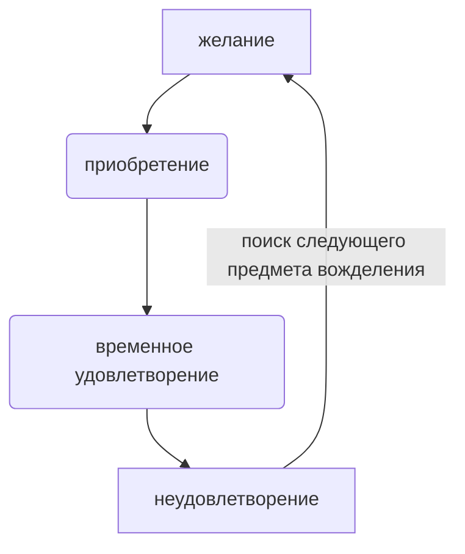

Аббревиатура от "Gear Acquisition Syndrome" — синдром приобретения оборудования.

Когда хочется покупать ещё и ещё устройства, плагины, библиотеки сэмплов. Кажется, что это принесёт радость, придаст творческий импульс и поднимет профессионально.

Часто случается цикл:

А творчество остаётся где-то в тени.
